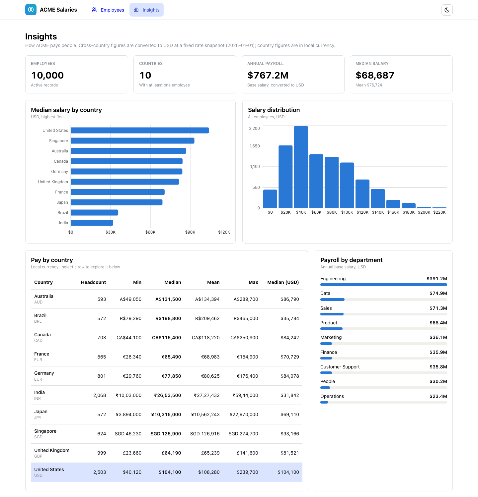
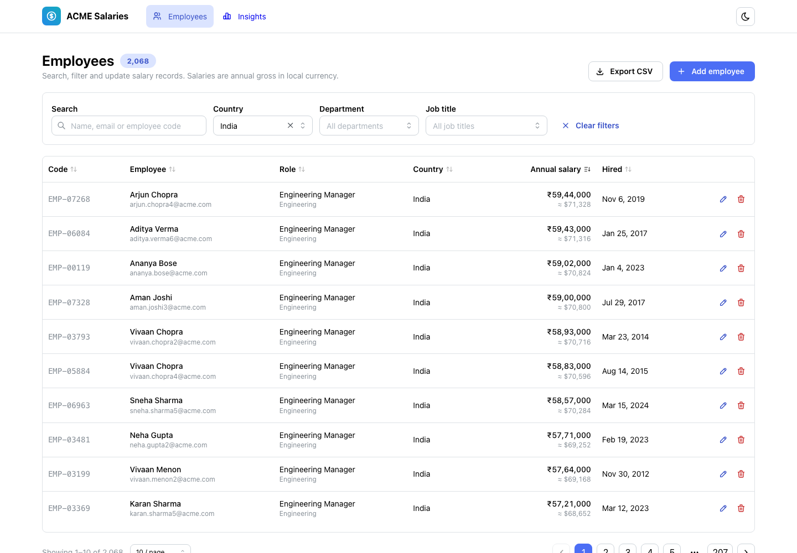
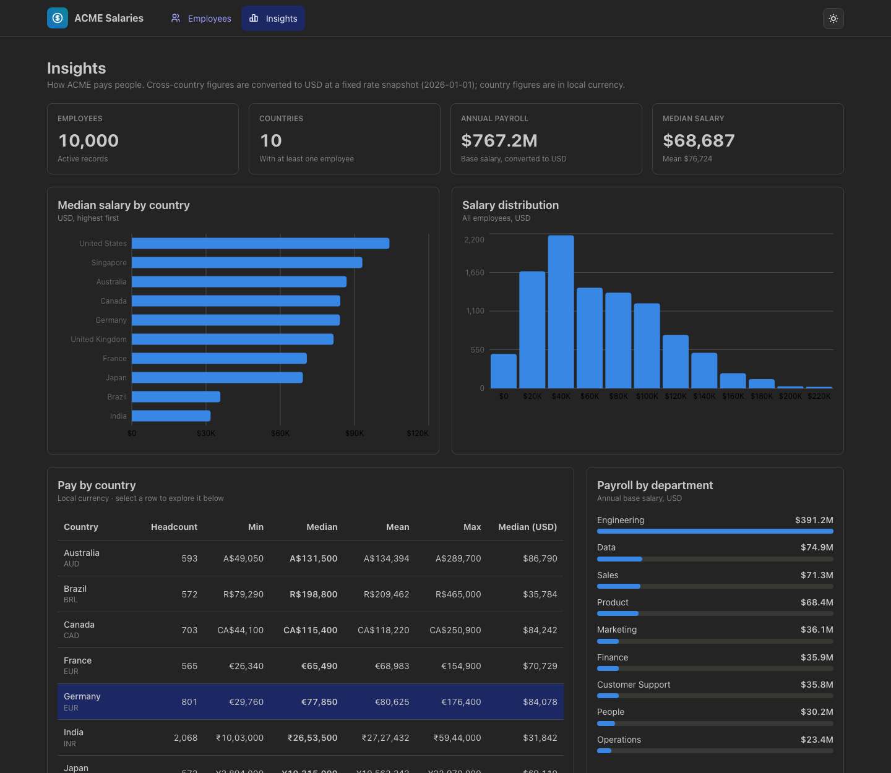

# ACME Salary Management

A web app that replaces the spreadsheets ACME's HR team uses to manage salaries for **10,000 employees across 10 countries**, and answers the question *"how does the org pay people?"*

**Live demo:** _<add your Render URL here>_ · **Demo video:** _<add your video link here>_



## What the HR manager can do

**Manage salary records** (`/employees`)
- Search 10,000 employees by name, email or employee code; filter by country, department and job title; sort by any column; page through results.
- See each salary in the employee's own currency, with a USD equivalent underneath (₹25,00,000 ≈ $30,000).
- Add, edit and delete employees. The form validates input, shows the live USD equivalent as you type, and shows server errors on the field that caused them.
- Export the current filtered view to CSV (formula-injection safe for Excel).
- Every view is a shareable URL: `/employees?country=IN&sort=salary_usd&order=desc`.

**Understand pay** (`/insights`)
- Headcount, annual payroll (USD), and median and mean salary.
- Median salary by country (USD, ranked) and the org-wide salary distribution.
- Min / median / mean / max per country in local currency.
- Payroll by department.
- Country deep dive: pay per job title with min–median–max range bars, plus that country's salary distribution (`/insights?country=IN`).

| Employees | Insights (dark mode) |
|---|---|
|  |  |

## How I approached it

Docs came before code, and every section was committed on its own. Read these in order:

1. [**Requirements**](docs/01-requirements.md): goal, persona, scope, and what's deliberately left out and why
2. [**Design notes**](docs/02-design.md): architecture, data model, API, trade-offs, measured performance, chart choices
3. [**AI workflow**](docs/03-ai-workflow.md): how Claude Code was used step by step, and where its output was corrected

Key decisions, in brief:
- **Salary is an integer** in whole local-currency units. **Currency comes from the country**, so the two can't disagree.
- **Cross-country comparisons use USD** from a fixed, dated rate snapshot. Sorting by salary sorts by USD, because 3,000,000 INR is not more than 150,000 USD.
- **Medians alongside means.** One executive salary distorts a mean. SQLite has no median, so it's computed by a small, unit-tested pure module.
- **One container** serves both the API and the React app: one URL, no CORS, one deploy.

## Tech stack

| Layer | Choice |
|---|---|
| Backend | Python 3.13, FastAPI, SQLAlchemy 2.0, Pydantic 2, SQLite (WAL) |
| Frontend | React 19, TypeScript, Vite, Mantine 9 (+ Charts), TanStack Query, React Router |
| Tests | pytest (117 tests, 96% coverage), Vitest + Testing Library (57 tests) |
| Tooling | uv, Ruff, oxlint, Prettier, GitHub Actions CI |
| Deploy | Docker (multi-stage), Render Blueprint (`infra/render.yaml`) |

## Running locally

### Option A: Docker (closest to production)

```bash
docker build -t acme-salary .
docker run -p 8000:8000 acme-salary      # http://localhost:8000 (seeds 10k employees on first boot)
```

### Option B: Dev servers

**Backend** (Python 3.13, [uv](https://docs.astral.sh/uv/)):

```bash
cd backend
uv sync                                   # install deps into .venv
uv run python -m app.seed                 # 10,000 employees (idempotent; --reset to re-seed)
uv run uvicorn app.main:app --reload      # API on :8000, docs at http://localhost:8000/docs
```

**Frontend** (Node 20+), in a second terminal:

```bash
cd frontend
npm install
npm run dev                               # http://localhost:5173, proxies /api to :8000
```

If port 8000 is taken, run the API on another port and point the proxy at it:
`uv run uvicorn app.main:app --port 8001` and `API_URL=http://localhost:8001 npm run dev`.

### Tests and checks

```bash
cd backend  && uv run pytest --cov=app && uv run ruff check . && uv run ruff format --check .
cd frontend && npm test && npm run lint && npm run typecheck && npm run format:check
```

Both suites run in a few seconds, are deterministic (in-memory DB per test, fixed seed, stubbed `fetch`), and run in CI on every push.

### Configuration

| Variable | Default | Purpose |
|----------|---------|---------|
| `DATABASE_URL` | `sqlite:///./salary.db` | SQLAlchemy URL |
| `SEED_ON_STARTUP` | `false` (`true` in Docker) | Seed employees on boot if the table is empty |
| `SEED_COUNT` | `10000` | How many employees to seed on startup |
| `STATIC_DIR` | unset (set in Docker) | Serve the built frontend from this directory |
| `PORT` | `8000` | Port inside the container (Render sets this) |

## Deploying to Render

1. On [render.com](https://render.com): **New → Blueprint**, then pick this GitHub repo. Set **Blueprint Path** to `infra/render.yaml`.
2. Click **Apply**. Render builds the Dockerfile and health-checks `/api/health`. The first boot seeds 10,000 employees.

On the free plan the disk is ephemeral, so edits reset when the service restarts or redeploys and the seed recreates the demo data. For real use, attach a persistent disk at `/data` or point `DATABASE_URL` at Postgres.

## Project structure

```
backend/
  app/
    api/            HTTP layer: employees, insights, meta, error mapping
    services/       business logic: employees, insights, stats (pure)
    models.py       SQLAlchemy models (Country, Employee)
    schemas.py      Pydantic API contract
    seed.py         deterministic 10k seed (+ seed_data.py)
    spa.py          serves the built React app
  tests/            API, service, stats, seed and SPA tests
frontend/
  src/
    api/            typed client, React Query hooks, types
    features/       employees/ and insights/ pages, components, pure helpers
    lib/format.ts   money and date formatting
docs/               requirements, design, AI workflow, screenshots
infra/render.yaml   Render Blueprint (deployment config)
Dockerfile · .github/workflows/ci.yml
```
