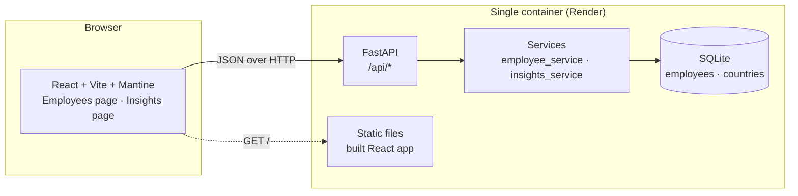
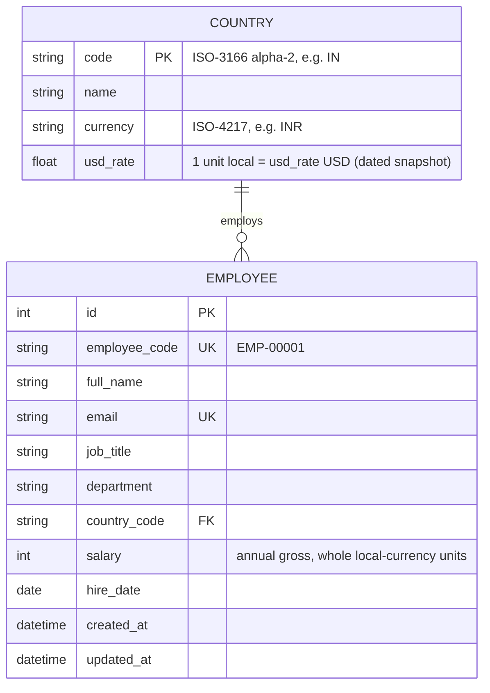

# Design Notes

## Architecture



**One deployable unit.** FastAPI serves both `/api/*` and the built React bundle. That means one Render service, one URL, no CORS in production, and no second deploy to keep in sync. In development Vite proxies `/api` to the backend.

### Backend layering

```
backend/app/
  main.py            app factory, router wiring, static files
  config.py          settings (env vars)
  db.py              engine / session / Base
  models.py          SQLAlchemy ORM (Country, Employee)
  schemas.py         Pydantic request/response models (API contract)
  reference_data.py  countries, currencies, FX rates, departments, job titles
  services/
    employees.py     queries & mutations (search / filter / sort / paginate)
    insights.py      aggregation queries
    stats.py         pure functions: median, percentile, histogram buckets
  api/
    employees.py     HTTP layer: validation, status codes, CSV export
    insights.py
    meta.py          reference data for UI dropdowns
  seed.py            deterministic 10k seed
```

### Frontend structure

```
frontend/src/
  api/client.ts          typed fetch wrapper, ApiError, one function per endpoint
  api/hooks.ts           React Query hooks; mutations invalidate employees + insights
  api/types.ts           TypeScript mirror of the API schemas
  features/employees/
    EmployeesPage.tsx    page composition: header, filters, table, pagination, drawer
    EmployeeTable.tsx    sortable table (local salary + ≈ USD)
    EmployeeFilters.tsx  debounced search + country/department/job-title selects
    EmployeeFormDrawer.tsx  create/edit form; API errors shown on the offending field
    employeeQuery.ts     URL <-> list state (pure parse/apply + hook)
    employeeForm.ts      validators, payload mapping, PATCH diffing (pure)
  lib/format.ts          Intl-based money/date formatting (INR uses lakh grouping)
```

Logic that can be pure *is* pure (`employeeQuery.ts`, `employeeForm.ts`, `format.ts`) and is unit-tested directly. Components are tested at page level with a stubbed `fetch`, so tests exercise real components, hooks and routing rather than mocks of them.

**List state lives in the URL** (`?country=IN&sort=salary_usd&page=3`). A refresh or the back button keeps the view, and an HR manager can send a colleague a link to "Indian engineers sorted by pay". Invalid URL values fall back to defaults.

**Edits send only changed fields** (PATCH diff), so saving a salary change can't overwrite a concurrent edit to someone's job title.

Routers are kept thin; services hold the logic; `stats.py` is pure and is the most unit-tested module. Routers depend on a `get_db` dependency, so tests swap in an in-memory database.

## Data model



Decisions:

- **Integer salary.** Money is never a float in storage. Whole currency units are precise enough for annual salaries and avoid minor-unit confusion (JPY has none).
- **Currency lives on Country, not on Employee.** A value that can be derived is not stored twice, so "an Indian employee paid in EUR" is impossible by construction.
- **FX snapshot in a table.** USD conversion is `salary * usd_rate` at query time. Updating the rates means updating 10 rows, not 10k.
- **Department and job title are strings**, not lookup tables. HR renames titles often, and a fixed enum would get in the way. The UI offers a curated list from `/api/meta`. With more time these would become managed lookup tables.
- **Indexes:** `country_code`, `department`, `job_title`, the composite `(country_code, job_title)` (for the insight in F5), and unique indexes on `email` and `employee_code`.

## API

| Method | Path | Purpose |
|--------|------|---------|
| GET | `/api/employees?search=&country=&department=&job_title=&sort=&order=&page=&page_size=` | Paginated list, returns `{items, total, page, page_size}` |
| GET | `/api/employees/export.csv?…same filters` | Streams CSV of the filtered set |
| GET | `/api/employees/{id}` | One employee |
| POST | `/api/employees` | Create (201). 409 on duplicate email, 422 on validation errors |
| PATCH | `/api/employees/{id}` | Partial update |
| DELETE | `/api/employees/{id}` | 204 |
| GET | `/api/insights/summary` | Headcount, payroll USD, avg/median USD, department breakdown |
| GET | `/api/insights/countries` | Per country: headcount, min/max/avg/median (local + USD) |
| GET | `/api/insights/countries/{code}/job-titles` | Per job title in a country: min/max/avg/median |
| GET | `/api/insights/distribution?country=` | Salary histogram (USD buckets) |
| GET | `/api/meta` | Countries, departments, job titles for dropdowns |
| GET | `/api/health` | Liveness |

Insight responses carry stats in both **local currency** and **USD**. USD stats are derived by scaling the local stats (`SalaryStats.scaled`), which is exact because min/max/mean/median are all linear in the values. Histogram bucket widths are "nice" 1/2/5×10ⁿ values, so labels read as $80k–$100k rather than $81,337–$92,110. Empty buckets inside the range are kept, so gaps show honestly.

`sort` is checked against an allow-list, so user input never reaches `ORDER BY` as raw SQL. Sorting by salary uses the **USD equivalent** (`salary_usd`): local amounts in different currencies can't be compared.

Domain errors (`EmployeeNotFoundError`, `DuplicateEmailError`, `UnknownCountryError`) are raised by services and mapped to 404/409/422 in one place (`app/api/errors.py`). CSV export streams rows and escapes cells that start with `= + - @` to block spreadsheet formula injection.

## Trade-offs

| Decision | Alternative | Why this one |
|----------|-------------|--------------|
| SQLite | Postgres | Zero-ops and a single file. 10k rows is tiny. SQLAlchemy keeps the swap cheap. Cost: on Render's free tier the disk is ephemeral, so data resets on redeploy. Mitigated by auto-seeding; a paid disk or Postgres fixes it. |
| `create_all` on startup | Alembic migrations | One table plus a lookup table, and no production data to migrate yet. Alembic is the first addition once the schema starts evolving (e.g. salary history). |
| Median computed in Python | SQL window functions | SQLite has no `MEDIAN`/`PERCENTILE_CONT`. Pulling `(group, salary)` sorted for 10k rows costs ~10 ms and gives exact, testable results. On Postgres this would move to `percentile_cont`. |
| Deterministic seed (fixed RNG seed, fixed hire-date window) | Faker / random each run | Same data on every machine and deploy, so demos, screenshots and bug reports are reproducible. Name pools are per region (Indian names in India, etc.), so the demo reads as real without adding a dependency. |
| Offset pagination | Keyset/cursor | HR wants "page 37 of 400" and jumping to a page. Offset over 10k indexed rows is cheap. Keyset matters at millions of rows. |
| Server-side filtering | Load everything client-side | 10k rows × ~10 fields would work, but it doesn't scale, it slows first paint, and it would ship every salary to the browser whatever the user is looking at. |
| Mantine | MUI / AntD | Good table, form and chart primitives, a small API, and no licensing gotchas (MUI's DataGrid Pro features are paid). |

## Performance considerations

- All list queries are `COUNT(*)` + `LIMIT/OFFSET` on indexed columns. The search uses `LIKE` over name/email/code. At 10k rows a full scan is about 1–3 ms in SQLite, so an FTS index isn't worth its complexity yet.
- Insight endpoints run one grouped query each. None of them loops over rows with N+1 queries.
- The seed uses a single bulk `INSERT` (executemany) inside one transaction: **10k rows in ~0.2 s**.

Measured on the seeded 10k database (MacBook, uvicorn, warm, single request):

| Request | Time |
|---------|------|
| `GET /api/employees` (page 1, name sort) | ~3 ms |
| `GET /api/employees?country=IN&department=Engineering&sort=hire_date` | ~4 ms |
| `GET /api/employees?search=sharma` (LIKE scan over name/email/code) | ~11 ms |
| `GET /api/employees?sort=salary_usd&order=desc&page=200` (computed sort, deep offset) | ~15 ms |
| `GET /api/employees/export.csv` (all 10k rows, streamed) | ~150 ms |
| `GET /api/insights/summary` (payroll, median, departments) | ~16 ms |
| `GET /api/insights/countries` (min/max/mean/median × 10 countries) | ~20 ms |
| `GET /api/insights/countries/IN/job-titles` | ~5 ms |
| `GET /api/insights/distribution` (org-wide histogram) | ~9 ms |
- SQLite runs in WAL mode for concurrent reads during writes.
- The frontend debounces search (300 ms) and keeps the previous page on screen while loading to avoid flicker.

## What I'd build next

1. Salary history table (effective-dated) plus an audit log of who changed what. This enables "raises in the last 12 months".
2. SSO auth, and role separation (HR Admin vs. read-only Finance).
3. CSV import with a dry-run preview and row-level errors.
4. Pay-equity views (gender or level bands). These need extra, sensitive attributes and a privacy review first.
5. Postgres, Alembic, and a scheduled FX-rate update with dated snapshots.
